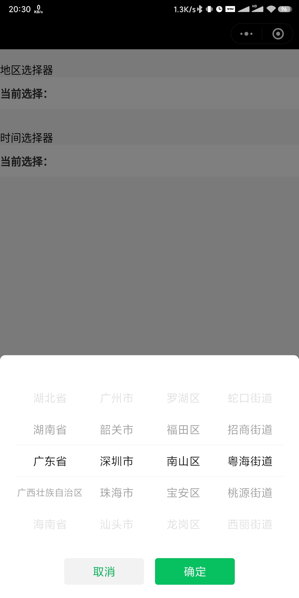
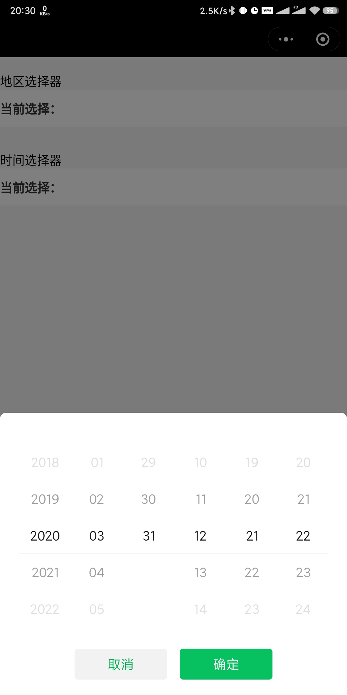

# 地区/时间联动选择器

## 简介

使用微信小程序原生picker封装，样式为微信原生样式

地区支持四级联动(省、市、区/县、街道/乡镇)，可自定义选择器粒度，最高支持四级选择，最低支持一级选择，支持设置打开选择器时默认选中地址，未传默认参数时，选中广东省深圳市南山区粤海街道

时间支持六级联动(年、月、日、时、分、秒)，可自定义选择器粒度，最高支持六级选择，最低支持一级选择，支持设置打开选择器时默认选中时间，未传默认参数时，选中当天日期 00:00:00

## 截图

## 不使用插件方式引用组件

将plugin/components下的picker-mode*文件放入小程序components目录

[自定义组件使用方法](https://developers.weixin.qq.com/miniprogram/dev/framework/custom-component/)

## appid 和 版本

    appid: wx591b7ec09cf7740f
    版本号: 1.0.0

## 使用插件方式接入流程

[通用接入流程微信官方文档](https://developers.weixin.qq.com/miniprogram/dev/framework/plugin/using.html)

### 本插件引入示例

app.json

    "plugins": {
        "pickerMod": {
            "version": "1.0.0", // 插件版本，如有新版本请写新版本号
            "provider": "wx591b7ec09cf7740f" // 选择器appid
        }
    }

### 配置引入页面的json文件

    {
        "usingComponents": {
            "pickerMod": "plugin://pickerMod/picker"
        }
    }

### 配置引入页面的wxml文件

插件外层需要包裹一层视图容器，插件会填充满该容器

    <pickerMod
        mode="选择器类型"
        level="选择器粒度"
        region="地区选择器默认选中"
        time="时间选择器默认选中"
        placeholder="显示文案"
        placeholderStyle="文案样式"
        placeholderClass="文案样式类"
        bindPickerValue="选择器点击确定时通过该方法返回值" >
    </pickerMod>

例如地区选择器：

    <view>
        <pickerMod
            mode="region"
            level="{{4}}"
            region="{{['广东省', '深圳市', '南山区', '粤海街道']}}"
            placeholder="当前选择："
            placeholderStyle="fontSize: 30rpx; line-height: 80rpx; color: #333333; font-weight: bold;"
            bindPickerValue="getPickerValue">
        </pickerMod>
    </view>

例如时间选择器：

    <view>
        <pickerMod
            mode="time"
            level="{{6}}"
            time="{{'2020-03-31 12:21:22'}}"
            placeholder="当前选择："
            placeholderStyle="fontSize: 30rpx; line-height: 80rpx; color: #333333; font-weight: bold;"
            bindPickerValue="getPickerValue">
        </pickerMod>
    </view>

### 配置引入页面的js文件

`region`或`time`自定义默认值

bindPickerValue绑定方法，获取返回值，如：

    getPickerValue(e) {
        console.log(e.detail)
    }

## 插件参数及使用

属性名|类型|默认值|说明
:--|:--|:--|:--
mode|string|region|有效值region,time，表示选择器的类型
level|number|6|mode为region时，有效值1-4；mode为time时，有效值1-6。表示选择器的粒度
region|arry|['广东省', '深圳市', '南山区', '粤海街道']|mode为region时，region值生效，根据选择的level的大小来确定region的数组长度。表示默认选中的地区
time|string|当天的年份-当天的月份-当天的日期 00:00:00|mode为time时，time值生效，根据选择的level的大小来确定time的日期长度。表示默认选中的时间
placeholder|string| |picker内显示的文案
placeholder-style|string| |指定 placeholder 的样式
placeholder-class|string| |指定 placeholder 的样式类
bindPickerValue|eventhandle| |value 改变时触发事件，event.detail = {value}

mod有效值：*
值|说明
:--|:--
region|地区选择器
time|时间选择器
